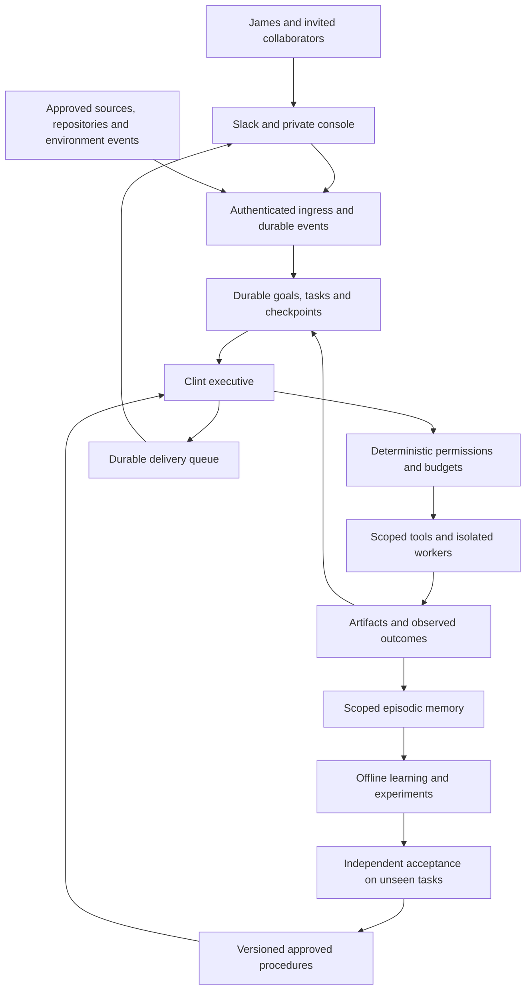

# Clint: research-led architectural reset

Decision date: 13 September 2026. Status: proposed replacement architecture, not deployed.
Owner update: preserve the custom Clint core and add Slack in LQ. The OpenClaw-first
replacement recommendation below is superseded by [Clint in LQ Slack](clint-slack-lq.md).
The architectural defects and research remain relevant; repair the affected components
within Clint rather than treating a new framework as the default migration.
This supersedes the recommendation to deploy the earlier stabilization release as the
finished overhaul. That work remains useful as a migration baseline and regression set.

## Decision

Rework the custom chat-first runtime while preserving Clint's core. Make Clint a persistent agent with durable projects,
an explicit agenda, scoped memory, an outcome-driven learning process and replaceable
communication channels. Use Slack as the primary owner/collaborator interface and retain
a private web console. External research, executable experiments and selected collaborators
provide its experience. WhatsApp becomes an optional adapter with no architectural role.

Do not build an idle bot society and expect intelligence to emerge. Do not reduce Clint
to a passive command processor either. It should initiate useful investigations within
standing goals, choose experiments, encounter failure, revise its understanding and carry
useful procedures into later work. This is a design objective, not an established claim
that the resulting system has general intelligence or unlimited autonomous learning.

James's direction is equal personal and technical/research capability, meaningful external
interaction, and automatic low-risk improvement under a defined policy. The previous
report-spacing-only policy did not adequately serve that ambition.

## What is fundamentally wrong with the existing design

These are findings from this repository, not claims inferred from research papers.

| Finding | Evidence | Consequence |
|---|---|---|
| Task state is ephemeral | `src/task-planner.js:14`: `planStore = new Map()` | A saved conversation does not make an interrupted plan recoverable. |
| Relevance is entangled with access | `src/cortex.js:134` passes project/chat boost keys; `src/tools/handler.js:47` searches memory without a principal/scope argument | A retrieval boost cannot enforce which memories a caller may see. The earlier private-DM exclusion avoids one write path but does not solve scoped recall. |
| Conversation is the main unit of experience | `src/buffer.js:16` stores a bounded rolling chat; `src/spire.js:114` awaits a venue event and responds | Spire exists, but the shown adapter lacks a task/outcome-to-procedure learning contract. Conversation can persist without producing reusable competence. |
| Learning has no demonstrated transfer objective | The replacement dream test checks source attribution; the real chat probe checks one exact reply | Neither establishes better performance on the next unfamiliar task. 1,374 passing software tests cannot establish agent intelligence. |
| The system has accumulated competing control paths | Router, cortex, planner, tool loop, legacy evolution, new review worker and venue adapters | Different paths can make different assumptions about identity, authority, persistence and success. |
| Model deployment assumptions are embedded in the design | Configured model ports failed; the real staged response took 55.953 seconds | Extra planning/classification calls can compound latency. The observed delay is end-to-end; it is not an isolated model benchmark. |

The previous fixes address actual defects. Their evidence remains valid, but the earlier
conclusion that a release-ready source tree amounted to the requested overhaul was too broad.

## What recent research supports

### Recency correction: work published in August–September 2026

The initial review over-weighted February–April papers and did not adequately cover the
latest work. James challenged that on 13 September. The following primary sources were
then checked, including relevant methods and limitations; these experiments have not been
independently reproduced here. The earlier sources below remain background, not evidence
that the initial search was current enough.

| Publication | Evidence and limitation | Change to the Clint proposal |
|---|---|---|
| [Grounding Agent Memory, 10 September 2026](https://arxiv.org/html/2609.11060v1) | Gives a post-task curator read-only environment tools to check and refresh proposed memories. Evaluated on database exploration and adapted consulting tasks; a new preprint, not general lifelong-learning proof. | Dreaming should include bounded evidence acquisition and rechecking, beyond summarizing recorded experience. Compare trajectory-only curation with environment-probing curation. |
| [When Validation Stops Learning, 9 September 2026](https://arxiv.org/html/2609.10873v1) | Shows analytically and in synthetic embodied diagnostics that an admission rule can suppress useful learning under a finite budget. No physical-robot validation. | Audit missed useful updates and evaluation cost. Zero unsafe promotions alone does not establish a functioning learner. Preserve hard authorization boundaries. |
| [Closing the Consistency Gap, 8 September 2026](https://arxiv.org/html/2609.08832v1) | AppWorld experiments improve repeated success using guidelines derived from unstable steps, including similar-task variants. The method admits generated guidelines directly; validation is future work. Stability does not establish correctness. | Use repeated-run failures to target learning, but retain independent factual/action checks and our promotion boundary. |
| [SimSkill, 3 September 2026](https://arxiv.org/html/2609.03753v1) | An agent constructs practice tasks in SUMO, executes them and develops procedural/semantic memory. Two 40-task benchmarks show model-dependent gains; one tested backbone gains nothing. Costs do not uniformly fall. | Give the curiosity queue a bounded self-generated curriculum in executable environments. Test transfer and total costs, not skill-library size. |
| [Meta Organizational Second Brain, 2 September 2026](https://engineering.fb.com/2026/09/02/ml-applications/organizational-second-brain-ai-learns-from-experts/) | First-party engineering report separates knowledge from analytical procedures and compiles expert corrections into reviewed, regression-tested edits. Human experts approve changes; this is not evidence for unrestricted auto-activation. | Diagnose corrections as missing knowledge, faulty method or unresolved disagreement before changing anything. |
| [Anthropic automated alignment researchers, listed 28 August 2026](https://alignment.anthropic.com/2026/automated-alignment-researchers/) | Researchers share methods and measured results through a forum and leaderboard while testing well-characterized failures. The study also detects cheating. Its training workload uses H200 compute, not an EVO-equivalent experiment. | A shared experiment forum can support agent collaboration. Exchange methods, evidence and failed attempts; discussion alone is not the learning signal. Do not transplant the training budget. |

These results sharpen rather than establish the proposed mechanism. The most consequential
additions are active memory verification, self-generated practice, and measuring whether
the learning gate actually permits useful progress. OpenClaw remains a substrate candidate;
none of these papers establishes it as the best final runtime.

### Earlier foundations and context

There is no single research result establishing the best general-purpose lifelong agent.
The relevant evidence concerns different capabilities, workloads and trust assumptions.
The following are primary research or first-party implementation reports, checked on the
decision date. Reported benchmark gains are not assumed to transfer to Clint.

| Source and date | Finding relevant to Clint | Design implication / limitation |
|---|---|---|
| [ACE, revised 29 March 2026; ICLR 2026](https://arxiv.org/abs/2510.04618v3) | Incremental, structured playbooks can retain useful procedures better than repeated monolithic summaries; execution feedback can drive adaptation. | Learn specific reusable procedures and preserve their history. This is benchmark evidence, not a guarantee against poisoned or incorrect memories. |
| [GEPA, revised 14 February 2026; ICLR 2026 Oral](https://arxiv.org/abs/2507.19457v2) | Uses execution trajectories and feedback to propose and evaluate prompt changes. | Judge changes against separate tasks; reflection is a proposal mechanism, not the acceptance criterion. |
| [Memento-Skills, 19 March 2026 technical report](https://arxiv.org/abs/2603.18743) | Develops an evolving external skill library without updating the underlying LLM weights. | There is a credible research basis for substantially more useful adaptation than cosmetic preferences. Reported gains remain specific to its evaluation. |
| [Sleep-time Compute, 17 April 2025](https://arxiv.org/abs/2504.13171) | Offline preparation can reduce later inference work; usefulness depends on how predictable future queries are. | Dream about active projects and likely needs. Unconstrained nightly rumination is not what this experiment established. |
| [Letta Memory Models, 25 June 2026](https://www.letta.com/blog/towards-agents-that-learn/) | Identifies lossy, overly specific and poorly transferable memories as unresolved limitations, and proposes specialized memory learning. | Treat durable memory quality as an open engineering/research problem. This is a vendor research direction, not an independently established solved capability. |
| [Scaling Agent Systems, revised 8 April 2026](https://arxiv.org/abs/2512.08296v3) | Controlled comparisons show collaboration can help decomposable tasks and harm sequential ones. | Use bounded specialist work and independent checking where useful; avoid a compulsory debate pipeline. |
| [Debate for research feedback, 16 July 2026 preprint](https://arxiv.org/abs/2607.14713) | In a masked study of 44 economics meta-analyses, authors preferred the single frontier-model report to the tested debate systems; model judges disagreed with people. | Human usefulness and model approval are different outcomes. This does not establish that debate never helps. |
| [Agent Reliability, revised 2 June 2026; ICML 2026](https://arxiv.org/abs/2602.16666v3) | Separates consistency, robustness, predictability and safety; benchmark capability improvements did not translate proportionately into reliability. | Evaluate repeat runs, disruptions and severity of errors, alongside task success. |
| [Anthropic Managed Agents, 8 April 2026](https://www.anthropic.com/engineering/managed-agents) | Separates durable session history, the model orchestration loop and execution environments. | Keep recoverable work state outside the model context and outside individual sandboxes. A first-party architecture report, not a comparative benchmark. |
| [Darwin Gödel Machine, 30 May 2025](https://sakana.ai/dgm/) | Explores self-modified coding agents using external programming benchmarks and an archive of variants. | Code evolution needs a real evaluator, compute budget and retained alternatives. Benchmark search does not justify production self-editing without boundaries. |

The [July 2026 self-improvement survey](https://arxiv.org/abs/2607.13104) provides a useful
taxonomy: distinguish what is updated—weights, prompts, memory, tools or control logic—from
the signal used to justify the update. Clint currently blurs several of these questions.

## What external interaction should mean

My recommendation is three complementary sources of experience:

1. **People:** James supplies objectives, corrections and judgments about usefulness.
   Invited collaborators supply expertise and genuine disagreement. Clint asks focused
   questions when the answer changes a decision, rather than manufacturing conversation.
2. **An environment with independently observable results:** repositories, tests, public
   documents, research datasets, calendar/task states and explicitly authorized APIs.
   Clint makes a prediction or chooses an action, observes what happened and compares it
   with the intended result. Uncertain side effects remain uncertain until reconciled.
3. **Other agents as collaborators:** a bounded request for a reproduction, critique or
   alternative approach. Prefer different information or methods; a different persona
   on the same model is not independent evidence. Consensus never establishes a fact.

A useful episode: Clint notices an unresolved retrieval problem in an active project,
finds a relevant new paper, reproduces one claim against public/synthetic data on the EVO,
asks a separate reviewer to challenge the test, and brings James the result and limitations.
The learned artifact is a tested retrieval procedure, a failed hypothesis or a precise
open question—not a diary entry saying it became wiser.

Its standing agenda should include owner commitments, ongoing investigations and a bounded
curiosity queue. Each exploratory item needs a connection to a goal, an information gap,
a testable next action and a stopping condition. Empty queues are allowed. Re-reading its
own memories is not a new experience and must not increase apparent evidential support.

Spire can remain a social/research venue when people or agents actually use it. A separate
Moorstead/Steads experiment could supply a changing game environment with executable rules,
provided that experiment is explicitly selected. A simulated world may test planning and
adaptation; transfer to personal or research work must be measured separately. The Spire
and Steads integrations are different systems and should not be conflated.

No platform supplies a community automatically. Moving an empty WhatsApp room to Slack
would preserve the lack of input. Useful independent work must continue when nobody chats.

## Interface decision

This recommendation concerns product fit and API design, not a measured uptime comparison.

| Surface | Fit for Clint | Decision |
|---|---|---|
| **Slack** | Official app events, threads, interactive responses and agent-specific surfaces. Socket Mode connects from the EVO without a public inbound request URL. | Primary owner/collaboration interface, in an owner-controlled workspace; never assume access to an employer workspace. |
| **Private web console / PWA** | We control task, evidence, experiment, approval and memory views; usable without a chat provider. Requires a modest UI build. | Canonical work/evidence interface and fallback. Scope to task inbox, artifacts and decisions first. |
| **Discord** | Official bot gateway; suitable if real collaborators already congregate there. General message-content access is a privileged intent. | Optional community adapter once there is an actual community to join. |
| **Telegram** | Official bot API, polling or webhooks; useful for mobile commands and notifications. Bots do not receive other bots' messages. | Good lightweight owner channel; poor foundation for the proposed agent-to-agent conversation forum. |
| **Matrix** | Standard application-service API and an infrastructure-controlled deployment option. Homeserver and encryption operation add work. | Prefer if control of the messaging infrastructure outweighs maintenance cost. |
| **WhatsApp / current Baileys path** | Existing social reach, but the current integration uses an unofficial library and has observed pairing failure. | Retire as the primary dependency. Optional future edge adapter only. |

Sources: [Slack Socket Mode](https://docs.slack.dev/apis/events-api/using-socket-mode/),
[Slack agent surfaces](https://docs.slack.dev/ai/developing-agents/),
[Discord gateway](https://docs.discord.com/developers/events/gateway),
[Telegram bot FAQ](https://core.telegram.org/bots/faq),
[Matrix application services](https://spec.matrix.org/latest/application-service-api/),
[Baileys maintainers' disclaimer](https://github.com/WhiskeySockets/Baileys/blob/master/README.md?plain=1).

Slack is a delivery/collaboration surface, not the system of record. Its free plan exposes
only recent message history and deletes older data under its retention rules; some AI
surfaces require a paid plan. Persist authorized source events/artifacts independently,
respecting the user's retention policy. Start with ordinary app threads if sufficient.
See [free-plan limits](https://slack.com/help/articles/27204752526611-Feature-limitations-on-the-free-version-of-Slack)
and [agent feature requirements](https://docs.slack.dev/ai/developing-agents/).

Socket Mode still needs reconnect handling, acknowledgement, deduplication and durable
processing. Treat channel delivery and agent execution as separate operations. No channel
should grant additional tool permissions merely because it is convenient. Meta's official
Cloud API overview could not be retrieved (HTTP 429); no claim is made here that its current
business/group features or terms are a suitable replacement for the present integration.

## Architecture

These are responsibilities, not a proposal for eleven microservices. Start with one
maintained runtime, a local durable store and isolated execution workers. The executive
chooses what to do; a separate deterministic boundary decides whether it may do it.

**Work state:** each task retains owner, scope, desired outcome, acceptance conditions,
inputs, checkpoint, outstanding action, budget and artifacts. A process restart resumes
work. Where an external operation may already have happened, reconcile using its receipt
or idempotency key; never promise generic exactly-once side effects.

**Memory:** separate immutable source episodes, attributed claims with dates/conflicts,
owner preferences, commitments, and procedural skills. Filter authorization before
retrieval/ranking. Personal, project and public scopes need separate access boundaries;
derived summaries inherit their sources' restrictions. In a public venue, do not mount
private memory or owner credentials at all. A small approved public persona can be shared.
Where projects have different authorized readers, isolate their credentials and stores;
project labels or retrieval boosts do not supply that boundary. Test indirect recall
through summaries, local files, delegated workers and generated artifacts.

**Outbound data:** enforce destination-aware disclosure for models, Slack messages and
attachments, link previews, search queries and every other network tool. Slack itself
receives content sent to it. Sensitive details stay in the private console by default;
Slack receives only permitted metadata or authenticated links whose preview cannot reveal
the underlying content. A model cannot grant itself a broader disclosure scope.

**Models:** retain the EVO for private storage, local inference where it meets the task,
embeddings and bounded experiments. Use a capable frontier model for difficult executive
reasoning on material permitted to leave the machine; select the model by paired task
evaluations, not a model-name loyalty or a parameter-count assumption. No private-to-cloud
fallback without an explicit data policy. This design does not require training weights.

**Learning:** after useful episodes, and opportunistically during idle periods, consolidate
evidence, resolve contradictions where sources permit, rehearse recurring failures and
propose procedural improvements. Nighttime is a scheduling option. Keep preparation for
likely future tasks separate from reflection on completed tasks.

**Autonomy:** automatically activate low-risk procedural changes only inside already
approved capabilities: search recipes, task templates, scoped retrieval strategies and
sandbox-only helpers. A trusted acceptance process outside the candidate's writable area
tests a frozen baseline and candidate, including held-out variants and adverse cases.
Activation is versioned, narrow and reversible, with a limited first-use trial. Factual
claims, legal rules and expanded permissions cannot be certified by a model score.
Credentials, shared runtime code, external publishing and consequential actions retain
separate policy gates. This is a proposed broader policy, not a capability already built.
Low risk is defined by a frozen capability envelope: allowed tools, destinations, readable
data scopes, writable artifact types and resource ceilings. Candidate procedures cannot
change that envelope, the evaluator or evidence rules. A better aggregate score never
offsets an unauthorized action. Search and retrieval changes are not inherently low risk.

## Reuse versus another bespoke stack

**Earlier candidate, no longer the default after the owner's direction: OpenClaw.** It already
documents channel adapters, a gateway/session architecture and staged memory consolidation.
Its current memory design records origin metadata and prevents recalled material from
being counted as new evidence. These are relevant maintained components to test instead
of reimplementing the whole personal-agent substrate. See
[architecture](https://docs.openclaw.ai/concepts/architecture),
[Slack adapter](https://docs.openclaw.ai/channels/slack),
[memory architecture](https://docs.openclaw.ai/concepts/memory-architecture) and
[dreaming](https://docs.openclaw.ai/concepts/dreaming).

This is not a recommendation to install its defaults with all tools enabled. Its own
[security documentation](https://docs.openclaw.ai/gateway/security) specifies one trust
boundary per gateway and recommends separate gateways/credentials for mixed-trust users.
Use separate private-owner and public-collaboration instances, with reviewed artifacts
crossing the boundary. Documentation does not establish that its memory or restart
semantics meet our acceptance tests; that must be demonstrated on a pinned version.
In particular, its documented project scope changes ranking/injection without partitioning
files, and its provenance handling declares a local-file coverage gap. Neither may stand
in for our access boundary. Its curated-memory rules also exclude external-origin content
and candidates from background sessions. Preserve those protections: autonomous research
needs a distinct observed-outcome-to-tested-procedure path, not relaxed memory trust rules.
The substrate may pass channel/session tests while failing the central learning requirement.
If enforcing these requirements needs another executive or fights the runtime's trust model,
prefer the thinner alternative below. OpenClaw is the first trial, not a selected final stack.

**Alternative if that trial fails:** a thin application over LangGraph, using a persistent
checkpointer and explicit policy boundary. It documents separate thread checkpoints and
cross-thread stores; an in-memory saver is not restart persistence. This offers more control
at the cost of rebuilding more channel and operator UX. See
[LangGraph persistence](https://docs.langchain.com/oss/javascript/langgraph/persistence).

**Letta** is a serious alternative where memory research is the main experiment, with a
self-hostable runtime and explicit memory focus. It should be compared as an alternative,
not added as a second autonomous controller behind OpenClaw. See
[Letta documentation](https://docs.letta.com/). Do not stack OpenClaw, Letta and LangGraph
merely because each has attractive features.

## Next implementation decision

The hardest unproved assumption is that retained procedures produce better work on new
tasks without increasing unauthorized behavior. Run the bounded comparison in
[clint-next-acceptance.md](clint-next-acceptance.md) before expanding the UI, integrating
private accounts or enabling automatic adaptation. An isolated OpenClaw candidate must
also pass restart, scope and transport-failure tests before a migration decision.

Retain the earlier provenance utilities, regression tests, existing integration knowledge
and source snapshots. Replace the planner state, shared memory access path, duplicate
control loops and chat-bound lifecycle. Do not bulk-import old inferred memories as truth.
No production change, new chat installation, external message, account charge or model
training was performed as part of this reassessment.
