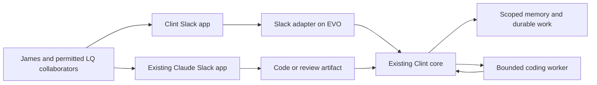

# Clint in LQ Slack, retaining the custom core

Current implementation/status: [restricted Slack release](clint-slack-release.md).
LQ refused a new app because its app limit was reached. James selected an alternative
workspace for now; no alternative has yet been identified. The implemented pilot adds
`groups:read` to inspect private-channel sharing metadata. The original proposal below
is historical where it describes an unbuilt adapter or only two bot scopes.

Decision: 13 September 2026. James wants to retain the agent he built and give Clint a
Slack presence, preferably in LQ, making use of his existing Claude Code integration.
This supersedes the OpenClaw-first replacement proposal. No app has been installed, no
credentials generated, and no Slack message sent. The browser now reaches LegalQuants
as James Cockburn. Its installed agents list shows Claude, and the app detail page says
it supports Claude Code routing and is managed by LegalQuants. Runtime migration variant,
Claude account entitlement and configuration permissions remain unverified.

## Recommended arrangement

Create a distinct Slack app named Clint connected to the existing EVO agent. Clint retains
his identity, memory, goals, domain tools and learning process. Repair ephemeral work state,
scope enforcement and learning within that core. Reuse Slack's maintained transport SDK;
do not build another model orchestration framework merely to add a channel.

Keep the existing Claude app alongside him. James can ask Clint to investigate, turn the
result into a precise coding brief, then invoke Claude for coding or independent review.
Clint records the returned artifact and its independently checked outcome. Claude's report
does not count as proof that a patch worked, and a PR is not approval to deploy it.

The artifact-to-Clint arrow is a proposed explicit handoff. Automatic bot-to-bot invocation
of the hosted Claude app is not established by the inspected documentation and has not
been tested. Do not depend on Clint posting an @Claude mention, spoof James's user identity,
or create an uncontrolled reply loop. Start with a human-triggered Claude task. For later
automatic coding, call an appropriately authenticated Claude Code/Agent SDK worker directly
with a bounded job, rather than treating the hosted Slack app as an undocumented API.

## Which existing integration can be reused

The official help center states that Claude in Slack switched to Claude Tag on 3 August
2026. It describes Team/Enterprise availability and organization-billed channel work.
An actual LQ inspection is needed to distinguish that from a custom Claude Code bridge or
an older installation. Do not change subscriptions or launch consumption-based features
based only on the user's phrase "Claude Code integration".
Source: [Claude Tag help](https://support.claude.com/en/articles/15594475-what-is-claude-tag).

Claude Tag runs in hosted sandboxes. Repository instructions and skills can carry over
after a permitted repository is cloned. EVO-local files and configuration do not. Its
documentation says repository hooks and `.mcp.json` servers do not run/load as they do
locally; external access uses admin-configured connections. Therefore simply asking the
hosted app to "be Clint" would not preserve the running custom agent.
Source: [For Claude Code users](https://claude.com/docs/claude-tag/concepts/for-claude-code-users).

The current Clint config contains Claude Code forge settings, including a subscription
mode flag. Their presence is not evidence that authenticated execution currently works.
Before using that route, inspect the actual executor, installed CLI/version, authentication
status and isolation. Do not expose the owner's CLI account or unrestricted shell directly
to workspace participants.

The current Agent SDK help page says the proposed June billing change was paused and
subscription-based SDK/`claude -p` use still draws subscription limits; its older text below
that notice is explicitly superseded. The SDK overview separately restricts offering
claude.ai login/limits through third-party products. Personal automation and shared LQ
service operation must therefore not be conflated. Verify the applicable account route;
make no promise that a shared bot is covered by James's subscription.
Sources: [SDK plan notice](https://support.claude.com/en/articles/15036540-use-the-claude-agent-sdk-with-your-claude-plan),
[SDK overview](https://code.claude.com/docs/en/agent-sdk/overview).

## Reviewable first installation

The [app manifest](../integrations/slack/app-manifest.json) requests only
`app_mentions:read` and `chat:write`, subscribing to `app_mention` over Socket Mode.
The separate app-level connection token needs `connections:write`. No credentials belong
in the manifest, repository, Slack conversation or assistant transcript.

Start in one private pilot channel, proposed name `clint-lab`, after inspecting existing
channels to avoid duplication. Invite only intended pilot participants. Clint processes
explicit mentions and replies in the originating thread. This minimal manifest does not
subscribe to all channel conversation, DMs or file content. In the pilot, a follow-up must
mention Clint again; broader ongoing-thread interaction requires a separately reviewed
event subscription and history scope. Do not pretend this pilot is the full social agent.

An installed bot's OAuth scopes are not a per-channel application allowlist. Runtime
configuration must enforce the exact LQ team ID, pilot channel ID and initial owner ID,
reject Slack Connect/shared-channel traffic, and reject bot-originated events by default.
The UI name "James" is not an identity check. Owner presence in a group does not make
group-visible replies private or give other members owner tools.

Socket Mode opens an outbound connection from the EVO; it does not need a public inbound
webhook or a tunnel. Use the official maintained SDK with a pinned dependency lock. Store
events durably before model execution, deduplicate retries, serialize each task/thread,
and separate response generation from delivery. Reconcile uncertain side effects.
Source: [Slack Socket Mode](https://docs.slack.dev/apis/events-api/using-socket-mode/).

## First-use proof before expanding access

Tier A: new channel identity and data disclosure. The critical journey is an allowed LQ
mention producing Clint's response in the same thread without granting private access or
executing the same action twice. Proof requires deterministic authorization and scope tests,
restart/retry tests, a fresh independent implementation review, and an explicitly authorized
live pilot exchange. The manifest alone does not implement or prove this journey.

The initial shared-channel mode must not mount private memories or credentials. The
existing Spire restricted mode is useful implementation reference, not proof that Slack
is isolated. Examine identity/context construction too, not only the tool allowlist.

Once that path passes, add ongoing thread replies and an opt-in research channel. Clint
can bring experimental results, ask useful questions and ingest corrections there under
a defined participation policy. Personal assistance stays in an appropriate private scope.
Retain the existing WhatsApp source as an optional adapter during migration; Slack activity
and background learning must not depend on WhatsApp being paired.

Slack sign-in is resolved. Continue inspecting configuration permissions, then present the exact
new access at Slack's installation screen before any permission grant. No plan upgrade,
workspace-wide access, invitations to people, external test messages or production cutover
are implied by preparing these files.
